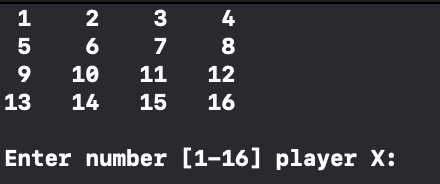
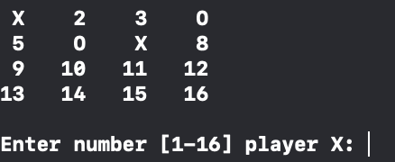
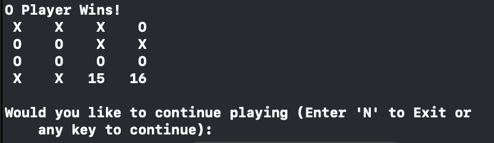

# Tic-Tac-Toe
Simple Tic-Tac-Toe Game created using C++ 

For the first game played, X player will play first. For further games after that, the starting players will alternate: O player will startin the second game, X player will startin the third game, and so on.

Players wins when 4 'X's or 'O's are placed in a horizontal, diagonal or vertical orientation. 
If the game board is filled with no winner, the game board will reset.

Game Configuration: 

 
Empty board 
    

 
Board during game 
    

 
Board at end of game
    
